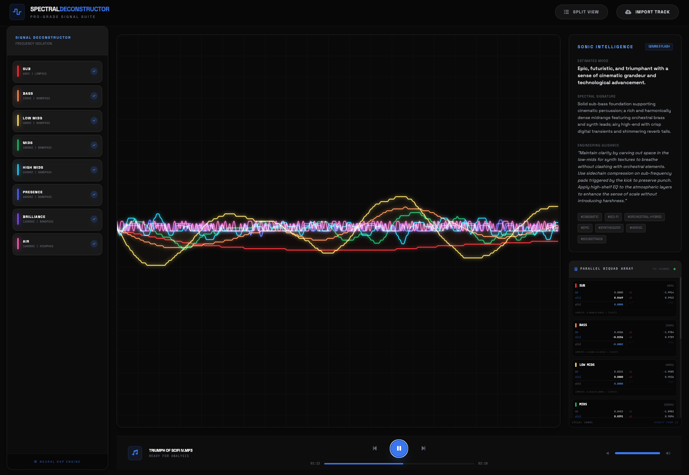

# 🌊 Spectral Waveform Deconstructor Pro

### High-Fidelity Signal Analysis & AI-Driven Sonic Intelligence

Spectral Waveform Deconstructor Pro is a high-performance Digital Signal Processing (DSP) suite engineered for professional audio analysis. By leveraging the **Web Audio API** and **Gemini 3 Flash**, it decomposes complex multi-instrumental audio into discrete frequency bands in real-time, offering unprecedented visibility into the molecular structure of sound.




---

## 🏗 System Architecture

The application utilizes a sophisticated multi-stage parallel signal chain designed for zero-latency isolation and analysis.

### 1. Signal Acquisition & Decoding
Raw PCM data from uploaded files is decoded using the browser's `AudioContext` and buffered into an `AudioBufferSourceNode`. This ensures high-fidelity playback with precise sample-offset seeking capabilities.

### 2. Discrete Band Isolation (DSP)
The primary signal is split into eight parallel branches. Each branch features a precision-tuned `BiquadFilterNode` configured as a **Direct Form II** filter. These nodes are dynamically adjusted to isolate narrow frequency ranges with minimal phase distortion.

### 3. Spectral Analysis Pipeline
Each isolated band is routed through a dedicated `AnalyserNode`. We perform high-resolution Fast Fourier Transforms (FFT) to extract time-domain waveform data and frequency energy distribution.

### 4. Precision Rendering Engine
The visualization layer implements a custom **Aperture Rendering** algorithm. By calculating the zero-crossing points of the waveform, we stabilize the visual output, ensuring a flicker-free, "oscilloscope-grade" experience for both transient and sustained signals.

---

## 🛠 Tech Stack

| Component | Technology | Rationale |
| :--- | :--- | :--- |
| **Frontend** | React 19 (Vite) | High-performance UI rendering with modern hooks. |
| **Logic** | TypeScript | Type-safe DSP calculations and state management. |
| **Audio Engine** | Web Audio API | Low-latency, hardware-accelerated signal processing. |
| **AI Intelligence** | Gemini 3 Flash | Real-time spectral profiling and engineering insights. |
| **Styling** | Tailwind CSS | Rapid development of a premium, responsive interface. |

---

## ✨ Pro Features

### 📡 Live DSP Telemetry
Gain direct access to the mathematical "truth" of the isolation engine. The **DSP Math Insight** panel provides:
- **Real-time Coefficients**: Live display of $b_0, b_1, b_2, a_1, a_2$ values as the filters operate.
- **Waveform Data Extraction**: Direct visualization of the $x[n]$ samples being processed.
- **Dynamic Formula Visualization**: See the difference equations in action on the live signal stream.

### 🧠 Gemini Sonic Intelligence
Automated analysis of every track using Google's most advanced lightweight model:
- **Mood & Atmosphere**: Instant estimation of the track's emotional profile.
- **Spectral Behavior**: Deep dive into expected frequency dominance.
- **Engineering Consultation**: Professional mixing and mastering advice tailored to the specific audio profile.

### 🎚️ Advanced Workspace
- **Overlay View**: A beautiful, translucent bloom visualization for spectral balancing.
- **Split View**: Stacked multi-track layout for granular inspection of individual frequency bands.
- **Synchronized Scrubbing**: Frame-accurate navigation with persistent waveform snapshots across all bands.

---

## 🚀 Getting Started

### Prerequisites
- Chrome, Edge, or Safari (Web Audio API support required).
- A **Gemini API Key**.

### Environment Setup
Create a `.env.local` file in the root directory:
```env
VITE_GEMINI_API_KEY=your_api_key_here
```

### Installation & Run
```bash
# Install dependencies
npm install

# Start development server
npm run dev
```

---

## 📐 Frequency Range Specification

| Band | Nominal Freq | Role |
| :--- | :--- | :--- |
| **SUB** | 60Hz | Foundation and low-end impact. |
| **BASS** | 150Hz | Weight and rhythmic definition. |
| **LOW MIDS** | 400Hz | Harmonic warmth and body. |
| **MIDS** | 1kHz | Core instrument and vocal presence. |
| **HIGH MIDS** | 2.4kHz | Clarity, snap, and definition. |
| **PRESENCE** | 6kHz | Attack transients and articulation. |
| **BRILLIANCE**| 12kHz | Air, sparkle, and spatial texture. |
| **AIR** | 16kHz | Ultra-high fidelity ambiance. |

---

## ⚖️ License

Distributed under the MIT License. See `LICENSE` for more information.

*Built for engineers who demand total visibility into their sound.*
